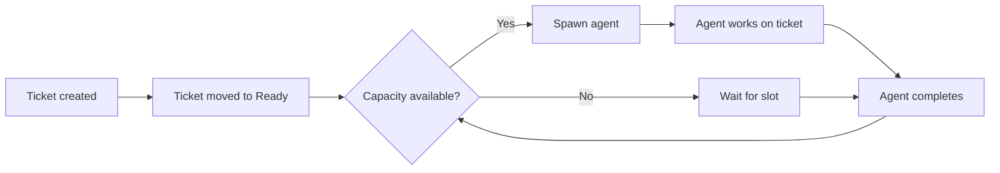

# Fork Features Guide

> Documentation for all features added in the RShuken/proletariat fork.
> These features extend the base prlt CLI with automated scheduling, monitoring, messaging, and multi-user support.

---

## Table of Contents

- [Webhook Notifications](#webhook-notifications)
- [Terminal Monitor](#terminal-monitor)
- [Agent Messaging](#agent-messaging)
- [Session Reporting](#session-reporting)
- [Smart Repo Mounting](#smart-repo-mounting)
- [Registering Local Repos](#registering-local-repos)
- [Scheduler Workflow](#scheduler-workflow)
- [Watchdog](#watchdog)
- [Multi-User Setup](#multi-user-setup)
- [Configuration Reference](#configuration-reference)

---

## Webhook Notifications

Send real-time notifications when agent events occur (completed, died, idle, needs input).

### Setup

```bash
# Interactive wizard
prlt notify setup

# Non-interactive
prlt notify setup --url https://hooks.slack.com/services/T.../B.../xxx --format slack

# With HMAC signing
prlt notify setup --url https://example.com/webhook --secret my-signing-key

# Skip the test ping
prlt notify setup --url https://ntfy.sh/my-agents --skip-test
```

### Flags

| Flag | Description |
|------|-------------|
| `--url <url>` | Webhook endpoint to POST notifications to |
| `--format <format>` | Payload format: `generic` (default) or `slack` |
| `--secret <secret>` | HMAC-SHA256 signing secret (sent as `X-Webhook-Signature` header) |
| `--name <name>` | Provider name (default: `webhook`) |
| `--skip-test` | Skip the test ping after saving config |
| `--json` | Machine-readable output |

### Events

The webhook fires on these events automatically:

- `on_agent_completed` — agent finished its work
- `on_agent_died` — agent session crashed
- `on_agent_idle` — agent has no more work
- `on_agent_needs_input` — agent is blocked waiting for human input

### Payload (generic format)

```json
{
  "event": "on_agent_completed",
  "agent": "swift-owl",
  "ticket": "TKT-042",
  "timestamp": "2026-04-06T12:00:00Z",
  "details": { ... }
}
```

For Slack format, the payload is wrapped in a Slack-compatible `blocks` structure.

---

## Terminal Monitor

Live terminal dashboard showing all running agents with output preview, git status, and uptime.

### Usage

```bash
# Start the dashboard (refreshes every 5 seconds)
prlt monitor

# Custom refresh interval
prlt monitor --interval 2

# Single snapshot (no refresh loop)
prlt monitor --once

# JSON output for scripting
prlt monitor --json
```

### Flags

| Flag | Description |
|------|-------------|
| `-i, --interval <secs>` | Refresh interval in seconds (default: `5`) |
| `--once` | Render once and exit |
| `--json` | JSON output mode |

### What it shows

For each running agent:

- Agent name and assigned ticket
- Last 3 lines of tmux pane output
- Current git branch and uncommitted change count
- Session uptime
- User who owns the session (in multi-user mode)

Sessions are filtered to the current user by default.

---

## Agent Messaging

Send messages between agents or from the operator to agents. Messages are stored in a durable queue and can be read by agents via `prlt msg list` or the MCP server.

### Send a message to an agent

```bash
prlt msg send swift-owl "The auth endpoint changed to /v2/login"

# Specify sender
prlt msg send swift-owl "Check the new schema" --from bold-eagle
```

### List messages for an agent

```bash
# List pending messages for the current agent
prlt msg list

# List for a specific agent
prlt msg list --agent swift-owl

# Include already-read messages
prlt msg list --agent swift-owl --all

# Mark messages as read after listing
prlt msg list --agent swift-owl --mark-read
```

### Broadcast to all active agents

```bash
prlt msg broadcast "Deploy freeze starts in 30 minutes"

# With explicit sender
prlt msg broadcast "New API keys rotated" --from operator
```

### msg send flags

| Flag | Description |
|------|-------------|
| `--from <name>` | Sender name (default: `$PRLT_AGENT_NAME` or `operator`) |

### msg list flags

| Flag | Description |
|------|-------------|
| `-a, --agent <name>` | Target agent (default: `$PRLT_AGENT_NAME`) |
| `--all` | Show all messages, not just pending |
| `--mark-read` | Mark listed messages as read |

### msg broadcast flags

| Flag | Description |
|------|-------------|
| `--from <name>` | Sender name (default: `$PRLT_AGENT_NAME` or `operator`) |

Broadcast finds all agents with active tmux sessions and enqueues a message to each (excluding the sender).

---

## Session Reporting

Report agent session lifecycle events. This is typically called by the Claude Code stop hook, not manually.

```bash
prlt session report --agent swift-owl --status completed
prlt session report --agent swift-owl --status errored
```

### Flags

| Flag | Description |
|------|-------------|
| `--agent <name>` | Agent name (required) |
| `--status <status>` | Session status: `started`, `completed`, `errored`, `exited` |
| `--json` | Machine-readable output |

On completion, the report command triggers:
- Container cleanup
- Ticket status update
- Auto-proposal if there are uncommitted changes

---

## Smart Repo Mounting

Tickets can declare which repositories they need. When an agent starts work, only those repos are mounted.

### Declaring repos on a ticket

```bash
# Single repo
prlt ticket create --title "Fix login bug" --category bug --repo openagent-connect

# Multiple repos
prlt ticket create --title "Cross-repo refactor" --category feature \
  --repo openagent-connect \
  --repo openagent-core
```

### How work start uses ticket repos

```bash
# Agent gets only the repos declared on the ticket
prlt work start

# Override with explicit repos
prlt work start --repo specific-repo

# Use independent clones instead of worktrees
prlt work start --clone
```

**Resolution order:**
1. `--repo` flag on `work start` (if provided)
2. `ticket.repos` field (if the ticket declared repos)
3. Interactive selection (fallback)

Worktrees are the default mount mode. Use `--clone` for full isolation (separate `.git` directory, no real-time sync with the parent repo).

---

## Registering Local Repos

Register an existing local git checkout without cloning or moving it.

```bash
# Register a repo already on disk
prlt repo add --path /home/user/projects/my-repo

# Standard clone (default behavior)
prlt repo add https://github.com/org/repo.git
```

### Flags

| Flag | Description |
|------|-------------|
| `-p, --path <path>` | Register an existing local git repo at this path (no clone) |
| `-a, --action <action>` | Action for local paths: `clone` (default) or `move` |
| `-b, --bulk` | Add multiple repositories interactively |
| `-f, --force` | Skip archived repository warning |

---

## Scheduler Workflow

The scheduler automates the ticket-to-agent pipeline: when a ticket reaches **Ready** status, the scheduler spawns an agent automatically.

### Flow

```
Ticket → Ready → Scheduler picks it up → Agent spawns → Agent works → Agent completes → Scheduler picks next ticket
```



### How it works

1. **Ticket enters Ready state** — the workflow system fires `on_ticket_ready`
2. **Capacity check** — scheduler checks: running agents < `max_agents`
3. **Priority ordering** — tickets are sorted: urgent > high/P1 > medium/P2 > low/P3 > none
4. **Agent spawn** — scheduler fires the `spawn-agent` orchestration action
5. **Completion** — agent finishes, `on_agent_completed` fires, scheduler dequeues and checks for the next Ready ticket
6. **Recovery** — if an agent dies (`on_agent_died`), the slot is freed and the scheduler tries the next ticket

### Configuration

```bash
# Set max concurrent agents (default: 3)
# Stored in workspace_settings as scheduler.max_agents
```

| Setting | Key | Default | Description |
|---------|-----|---------|-------------|
| Max agents | `scheduler.max_agents` | `3` | Maximum concurrent agent sessions |
| Poll interval | (hardcoded) | 30 seconds | How often the scheduler checks for Ready tickets |

The scheduler is also **event-driven**: it reacts to `on_agent_completed` and `on_agent_died` events with a 1-second defer, so new agents spawn almost immediately when a slot opens.

---

## Watchdog

The watchdog monitors running agent sessions and takes corrective action automatically.

### What it monitors

| Condition | Detection | Action | Cooldown |
|-----------|-----------|--------|----------|
| **Context exhaustion** | Parses Claude Code JSONL logs for token usage (>80% of context window) | Sends `/compact` to the tmux pane | 5 minutes |
| **Crash** | Detects dead tmux sessions | Restarts session with same ticket and prompt | Immediate |
| **Stuck agent** | No new output for 5+ minutes | Sends a "poke" message to the agent | 5 minutes |
| **Permission prompt** | Pattern-matches approval prompts in pane output | Auto-sends `y` (danger mode) | Immediate |

### Context window limits (hardcoded)

| Model | Context window |
|-------|---------------|
| claude-opus-4-6 | 1,000,000 tokens |
| claude-opus-4-5 | 1,000,000 tokens |
| claude-sonnet-4-6 | 200,000 tokens |
| claude-sonnet-4-5 | 200,000 tokens |
| claude-haiku-4-5 | 200,000 tokens |
| Default | 200,000 tokens |

The compact action fires when usage exceeds 80% of the model's context window (i.e., when remaining capacity drops below the `context_threshold` of 20%).

### Configuration

All watchdog settings are stored in `workspace_settings`:

| Setting | Key | Default | Description |
|---------|-----|---------|-------------|
| Enabled | `watchdog.enabled` | `true` | Master switch |
| Context detection | `watchdog.context_detection` | `true` | Monitor token usage |
| Crash recovery | `watchdog.crash_recovery` | `true` | Auto-restart dead sessions |
| Stuck detection | `watchdog.stuck_detection` | `true` | Detect idle agents |
| Auto-permit | `watchdog.auto_permit` | `true` | Auto-approve permission prompts |
| Context threshold | `watchdog.context_threshold` | `0.20` | Remaining capacity ratio that triggers compact |
| Stuck timeout | `watchdog.stuck_timeout_secs` | `300` | Seconds of no output before poke (5 min) |

---

## Multi-User Setup

Multiple users can share a single prlt workspace (e.g., on a shared Mac Mini or server) with session isolation.

### User scoping

Each user's sessions are prefixed with their username:

```
alice--TKT-042-Implement-swift-owl
bob--TKT-043-Review-bold-eagle
```

This prevents collisions in tmux session names and lets commands like `prlt monitor` and `prlt session list` filter to the current user.

### Setting the user

The user identity is resolved in this order:

1. `PRLT_USER` environment variable (explicit override)
2. `USER` environment variable (standard Unix)
3. `os.userInfo().username` (OS fallback)
4. `unknown` (last resort)

```bash
# Override user identity
export PRLT_USER=alice
prlt monitor   # Only shows alice's sessions
```

### SSH access

For a shared server setup:

1. **Each SSH session** gets its own `$USER` or `PRLT_USER` value
2. **Shared workspace** — all users point to the same HQ directory (e.g., `~/AI/hq/`)
3. **Worktree isolation** — each agent creates isolated git worktrees, no cross-contamination
4. **Container isolation** — Docker containers get agent-specific mounts and credentials
5. **Session isolation** — tmux sessions are user-prefixed, no naming collisions

### Database concurrency

SQLite runs in WAL (Write-Ahead Logging) mode, enabling concurrent reads and writes from multiple users. No external database server needed.

### Credentials

- Each user's SSH keys are used for git operations in their containers
- `ANTHROPIC_API_KEY` (or OAuth token) is passed per-user to agent containers
- Set these in your shell profile or pass via environment

```bash
# Example .bashrc for shared server
export PRLT_USER="alice"
export ANTHROPIC_API_KEY="sk-ant-..."
```

### Message routing

Agents can message across user boundaries. `prlt msg send` and `prlt msg broadcast` work regardless of which user owns the target agent's session.

---

## Configuration Reference

All fork-specific settings stored in the `workspace_settings` table:

### Webhook

| Key | Type | Default | Description |
|-----|------|---------|-------------|
| `webhook.url` | string | — | POST endpoint for notifications |
| `webhook.enabled` | boolean | `false` | Enable/disable notifications |
| `webhook.format` | string | `generic` | Payload format: `generic` or `slack` |
| `webhook.secret` | string | — | HMAC-SHA256 signing secret |

### Scheduler

| Key | Type | Default | Description |
|-----|------|---------|-------------|
| `scheduler.max_agents` | integer | `3` | Maximum concurrent agent sessions |

### Watchdog

| Key | Type | Default | Description |
|-----|------|---------|-------------|
| `watchdog.enabled` | boolean | `true` | Master switch |
| `watchdog.context_detection` | boolean | `true` | Monitor context window usage |
| `watchdog.crash_recovery` | boolean | `true` | Auto-restart crashed sessions |
| `watchdog.stuck_detection` | boolean | `true` | Detect idle agents |
| `watchdog.auto_permit` | boolean | `true` | Auto-approve permission prompts |
| `watchdog.context_threshold` | float | `0.20` | Remaining capacity ratio for compact trigger |
| `watchdog.stuck_timeout_secs` | integer | `300` | Seconds before stuck detection fires |

### Environment Variables

| Variable | Description |
|----------|-------------|
| `PRLT_USER` | Override the current user identity for session scoping |
| `PRLT_AGENT_NAME` | Set automatically in agent containers; used as default sender in messaging |
| `ANTHROPIC_API_KEY` | API key passed to agent containers |
